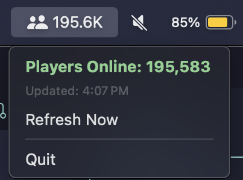

# OSCAR (Old School Currently Active RuneScapers)

<!--  -->

    

Simple MacOS status bar app which displays the current player count of Old School RuneScape. Data is scraped from the official Old School RuneScape homepage.

## Features

- Displays current player count in the menu bar
- Updates every 5 minutes
- Manual refresh button
- Status bar turns to "Offline" when game is offline[^1]

## macOS Security Warning

This application is unsigned, so macOS will display a security warning when you first run it. This is normal for unsigned applications.

To run the app:
1. Open the app, and macOS may complain about it being from an unidentified developer, and offer to move the app to the Trash. Click **Cancel**
2. Go to **System Preferences** → **Security & Privacy** → **General**
3. Click **Open Anyway** next to the app warning
4. Confirm by clicking **Open** in the dialog that appears

After the first run of each release, you won't need to do this again.

---

[^1]: The game is considered offline when the player count is 0, or if the `p.player-count` DOM element is missing, which may not always be accurate. The official status page is manually updated by Jagex and thus not an accurate reflection of real-time server status. The player count from the homepage is live data.
