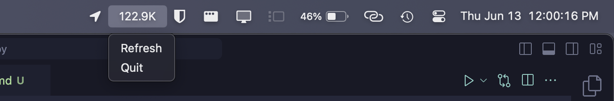

# OSCAR (Old School Current Active RuneScapers)
OSCAR is a simple MacOS status bar entry that displays how many players are currently on OSRS



## Usage
- Start OSCAR
- Player count will update every 10-minutes
- Stop the app by clicking the status bar entry and clicking 'Quit'

## Download
1. Check out the [releases](https://github.com/JoshPaulie/OSCAR/releases) page for the latest build.
2. Download **OSCAR.zip**
3. Unzip from within Finder
4. Move the OSCAR.app wherever you'd like
5. Run it 😌

### Alternate install (from source)
```
git clone https://github.com/JoshPaulie/OSCAR
cd OSCAR
make setup
make build
```

## Requirements
- MacOS

> [!Note]
> This app is untested on Intel processors, and likely only works on arm64 (Apple Silicon)

## Logging
The OSCAR log file can be found at `~/Library/Logs/OSCAR.log`

All player count updates and errors can be found in this log file, which can be easily iterated over to gather player count over time

> [!Caution]
> This is an unmanaged log file, with no size limit.